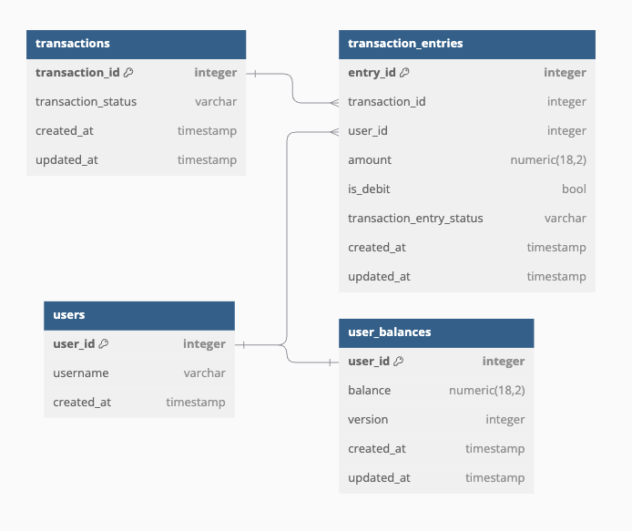
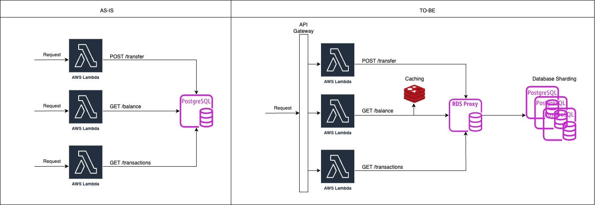
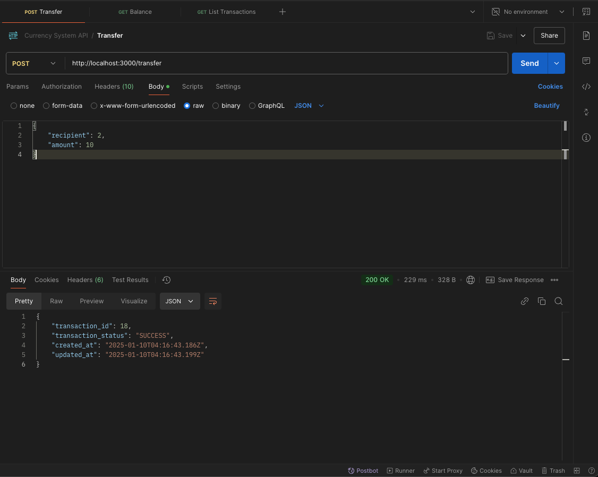

# In-Game Currency System

This repository contains a project focused on developing an in-game currency system for a gaming platform.

**_NOTE:_** This project serves as part of an interview process.


------------------------------------------------------------------------------------------

## Overview

Our system is built on a serverless architecture.

### Database Design
I adopted a double-entry bookkeeping approach for the database design to support a high throughput of write transactions, particularly for transfers. The project involves four tables, as shown in the following diagram:



### Implementation
- Balance Query: To retrieve a user's balance, I directly query the user_balances table.
- Transaction Listing: For listing transactions, I query the transaction_entries table, applying limits and offsets to paginate results.
- Transfers: When handling transfers, I implemented Optimistic Concurrency Control (OCC) to update user balances, which means some transactions may occasionally fail but will be retried or handled appropriately.

### Areas for Improvement
This section gathers the idea that should improve in the future.
- Using `redis` to cache the result of user balance improving read throughput
  - Challenge: Determining the optimal strategy for cache invalidation.
- Database sharding to improve write throughput
  - Challenge: Managing the added complexity that sharding introduces.
- Add authentication & authorization middleware to make API secure
- Handle error & Logging more properly
- Add retry mechanicsm for transfer
  - Challenge: Ensuring that the retry process prevents double-spending issues.

### System Diagram
The diagram below provides a high-level overview of the system, showcasing the current state ("as-is") and planned future state ("to-be") of the project:


### API Specs
There are 3 endpoints which is implement in separate AWS lambda.
<details>
<summary><code>POST</code> <code><b>/</b></code> <code>transfer</code></summary>

##### Header

> | Key        |  Type     | Data Type   | Description            |
> |------------|-----------|-------------|------------------------|
> | user-id    |  required | Number      | User ID                |

##### Body
> | Key        |  Type     | Data Type   | Description            |
> |------------|-----------|-------------|------------------------|
> | recipient  |  required | Number      | Recipient User ID      |
> | amount     |  required | Number      | Amount                 |
##### Body (Example)
```json
{
    "recipient": 2,
    "amount": 10
}
```

##### Response (Example)
```json
{
    "transaction_id": 18,
    "transaction_status": "SUCCESS",
    "created_at": "2025-01-10T04:16:43.186Z",
    "updated_at": "2025-01-10T04:16:43.199Z"
}
```
</details>

<details>
<summary><code>GET</code> <code><b>/</b></code> <code>balance</code></summary>

##### Header

> | Key        |  Type     | Data Type   | Description            |
> |------------|-----------|-------------|------------------------|
> | user-id    |  required | Number      | User ID                |

##### Response (Example)
```json
{
    "user_id": 1,
    "balance": "10000.00",
    "created_at": "2025-01-10T04:12:32.861Z",
    "updated_at": "2025-01-10T04:12:32.861Z"
}
```
</details>
<details>
<summary><code>GET</code> <code><b>/</b></code> <code>transactions</code></summary>

##### Header

> | Key        |  Type     | Data Type   | Description            |
> |------------|-----------|-------------|------------------------|
> | user-id    |  required | Number      | User ID                |

##### Parameters
> | Key        |  Type     | Data Type   | Description                                     |
> |------------|-----------|-------------|-------------------------------------------------|
> | page       |  optional | Number      | Page number (Default: 1)                        |
> | limit      |  optional | Number      | Limit of transactions per page (Default: 10)    |

##### Request (Example)
```
http://localhost:3000/transactions?page=1&limit=5
```
##### Response (Example)
```json
[
    {
        "entry_id": 33,
        "transaction_id": 17,
        "user_id": 1,
        "amount": "5000.00",
        "is_debit": false,
        "transaction_entry_status": "FAIL",
        "created_at": "2025-01-10T04:14:29.740Z",
        "updated_at": "2025-01-10T04:14:29.745Z"
    },
    {
        "entry_id": 31,
        "transaction_id": 16,
        "user_id": 1,
        "amount": "5000.00",
        "is_debit": false,
        "transaction_entry_status": "FAIL",
        "created_at": "2025-01-10T04:14:29.191Z",
        "updated_at": "2025-01-10T04:14:29.203Z"
    },
    {
        "entry_id": 29,
        "transaction_id": 15,
        "user_id": 1,
        "amount": "5000.00",
        "is_debit": false,
        "transaction_entry_status": "SUCCESS",
        "created_at": "2025-01-10T04:14:28.683Z",
        "updated_at": "2025-01-10T04:14:28.694Z"
    },
    {
        "entry_id": 27,
        "transaction_id": 14,
        "user_id": 1,
        "amount": "10.00",
        "is_debit": false,
        "transaction_entry_status": "SUCCESS",
        "created_at": "2025-01-10T04:14:18.166Z",
        "updated_at": "2025-01-10T04:14:18.182Z"
    },
    {
        "entry_id": 25,
        "transaction_id": 13,
        "user_id": 1,
        "amount": "10.00",
        "is_debit": false,
        "transaction_entry_status": "SUCCESS",
        "created_at": "2025-01-10T04:14:17.580Z",
        "updated_at": "2025-01-10T04:14:17.591Z"
    }
]
```
</details>


## Prerequisites
- [NodeJS](https://nodejs.org/en/download) (LTS version 22)
- [Serverless Framework](https://www.serverless.com/framework/docs/getting-started)
- [Docker](https://www.docker.com/)
- [Postman](https://www.postman.com/downloads/)

## Instructions

### Initial Setup
Install the necessary dependencies by running:

```bash
npm install
```

### Launch the Database
Start the database using Docker Compose:

```
docker-compose up -d
```

### Initialize the Database
Execute the following to apply migrations and set up the database schema:

```
npm run migrate:up
```

### Local development

The easiest way to develop and test your function is to use the `serverless-offline` command:

```
serverless offline
```
the result from the command should be like this.
```bash
   ┌────────────────────────────────────────────────────────────────────────────────┐
   │                                                                                │
   │   GET  | http://localhost:3000/balance                                         │
   │   POST | http://localhost:3000/2015-03-31/functions/balance/invocations        │
   │   POST | http://localhost:3000/transfer                                        │
   │   POST | http://localhost:3000/2015-03-31/functions/transfer/invocations       │
   │   GET  | http://localhost:3000/transactions                                    │
   │   POST | http://localhost:3000/2015-03-31/functions/transactions/invocations   │
   │                                                                                │
   └────────────────────────────────────────────────────────────────────────────────┘

Server ready: http://localhost:3000 🚀
```

### Test API
In folder `postman/`, there is collection file `api_collection.json` that you can import to `Postman` collection.



### Deployment

In order to deploy this project, you need to run the following command:

```
serverless deploy
```
**_NOTE:_** Deployment hasn't been tested yet because I focus on testing in local.